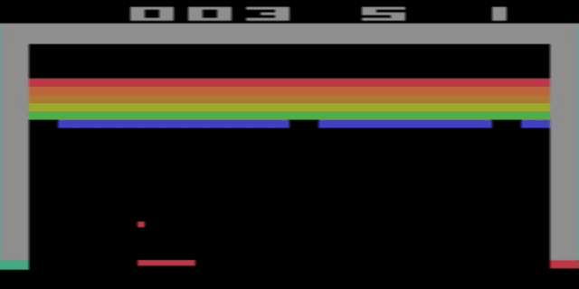

# Reinforcement Learning

> Introduction

In this repository I have re-written a large number of examples from
Lazy Programmers repository, specifically RL2 and RL3 into Tensorflow 2.
https://github.com/lazyprogrammer/machine_learning_examples

These re-implementations are not perfect and I would encourage anybody
to have a go optimising hyper-parameters and making modifications! 

> Tools

Developed in Python 3.7.6, using Tensorflow 2.2.0,
it has not been tested in environments outside of this.
